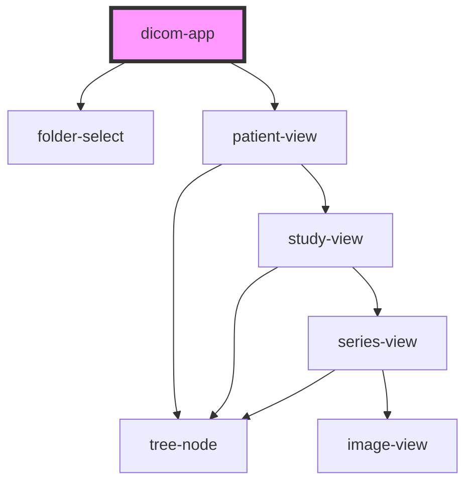

# dicom-app

<!-- Auto Generated Below -->

## Properties

| Property | Attribute | Description | Type            | Default     |
| -------- | --------- | ----------- | --------------- | ----------- |
| `files`  | --        |             | `ArrayBuffer[]` | `undefined` |

## Methods

### `getSelectedFiles() => Promise<Uint8Array[][]>`

#### Returns

Type: `Promise<Uint8Array[][]>`

## Dependencies

### Depends on

- [folder-select](../folder-select)
- [patient-view](../views/patient-view)

### Graph

----------------------------------------------

*Built with [StencilJS](https://stenciljs.com/)*
