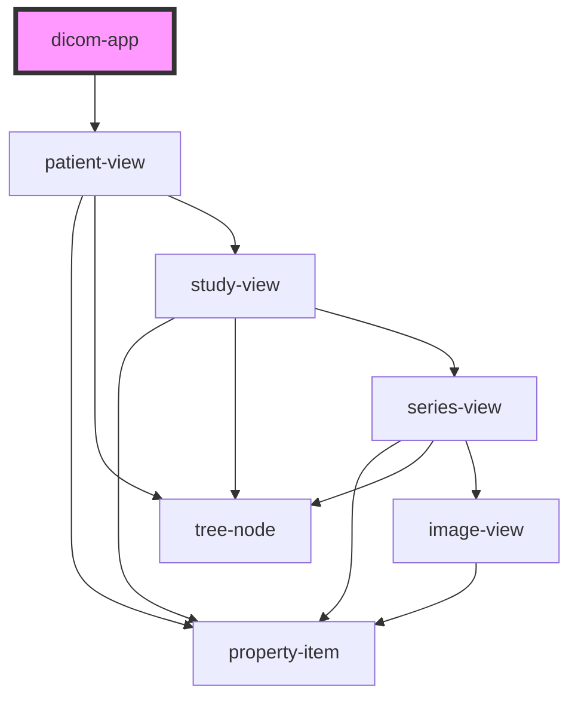

# dicom-app

<!-- Auto Generated Below -->

## Properties

| Property    | Attribute | Description | Type       | Default     |
| ----------- | --------- | ----------- | ---------- | ----------- |
| `blackList` | --        |             | `String[]` | `undefined` |

## Methods

### `getSelectedFiles() => Promise<Uint8Array[][]>`

#### Returns

Type: `Promise<Uint8Array[][]>`

### `loadFiles(fileBuffer: ArrayBuffer[]) => Promise<void>`

#### Returns

Type: `Promise<void>`

## Dependencies

### Depends on

- [patient-view](../views/patient-view)

### Graph

----------------------------------------------

*Built with [StencilJS](https://stenciljs.com/)*
