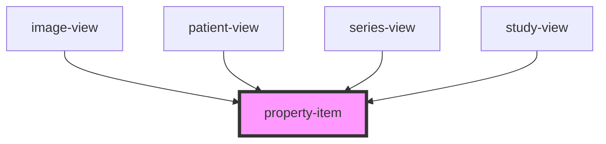

# property-item

<!-- Auto Generated Below -->

## Properties

| Property     | Attribute | Description | Type     | Default     |
| ------------ | --------- | ----------- | -------- | ----------- |
| `descriptor` | --        |             | `String` | `undefined` |
| `value`      | --        |             | `String` | `undefined` |

## Dependencies

### Used by

 - [image-view](../views/image-view)
 - [patient-view](../views/patient-view)
 - [series-view](../views/series-view)
 - [study-view](../views/study-view)

### Graph

----------------------------------------------

*Built with [StencilJS](https://stenciljs.com/)*
