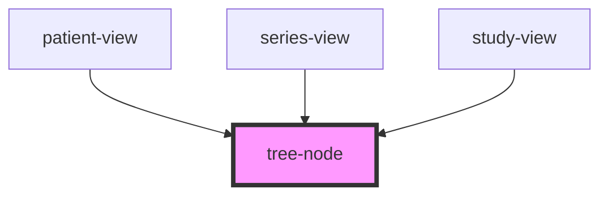

# tree-node

<!-- Auto Generated Below -->

## Properties

| Property | Attribute | Description | Type      | Default     |
| -------- | --------- | ----------- | --------- | ----------- |
| `down`   | `down`    |             | `boolean` | `undefined` |

## Dependencies

### Used by

 - [patient-view](../views/patient-view)
 - [series-view](../views/series-view)
 - [study-view](../views/study-view)

### Graph

----------------------------------------------

*Built with [StencilJS](https://stenciljs.com/)*
