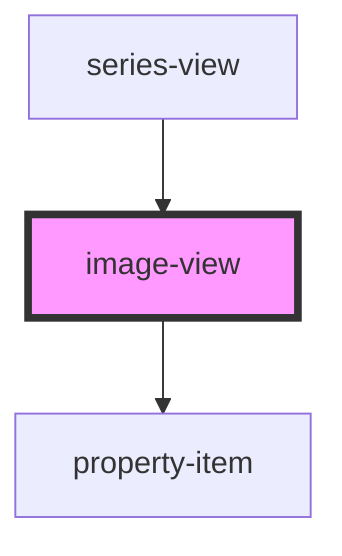

# image-view

<!-- Auto Generated Below -->

## Properties

| Property | Attribute | Description | Type    | Default     |
| -------- | --------- | ----------- | ------- | ----------- |
| `image`  | --        |             | `Image` | `undefined` |

## Dependencies

### Used by

 - [series-view](../series-view)

### Depends on

- [property-item](../../property-item)

### Graph

----------------------------------------------

*Built with [StencilJS](https://stenciljs.com/)*
