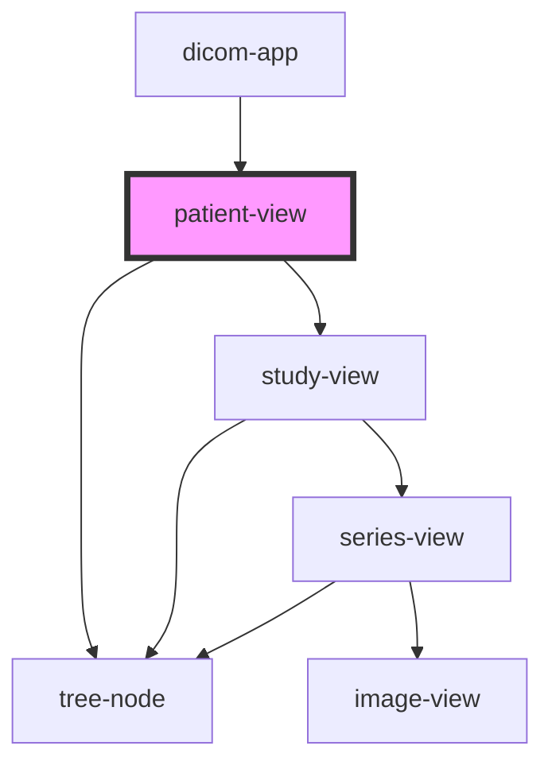

# patient-view

<!-- Auto Generated Below -->

## Properties

| Property  | Attribute | Description | Type      | Default     |
| --------- | --------- | ----------- | --------- | ----------- |
| `patient` | --        |             | `Patient` | `undefined` |

## Dependencies

### Used by

 - [dicom-app](../../app)

### Depends on

- [tree-node](../../tree-view)
- [study-view](../study-view)

### Graph

----------------------------------------------

*Built with [StencilJS](https://stenciljs.com/)*
