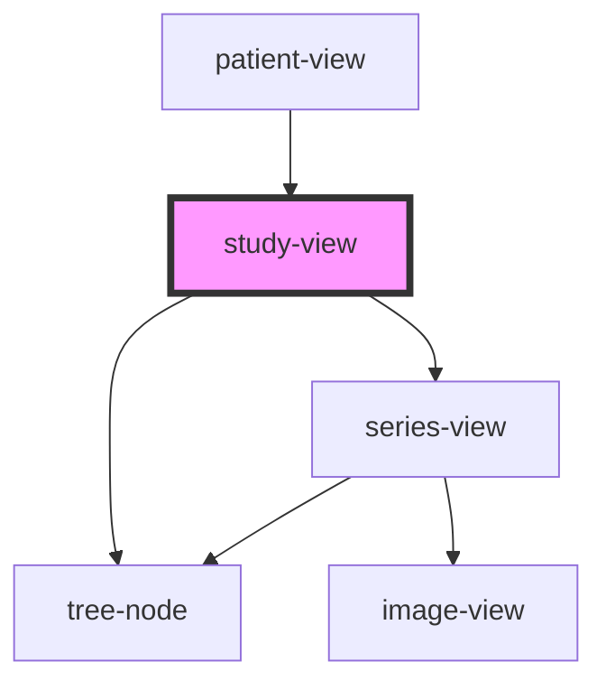

# study-view

<!-- Auto Generated Below -->

## Properties

| Property | Attribute | Description | Type    | Default     |
| -------- | --------- | ----------- | ------- | ----------- |
| `study`  | --        |             | `Study` | `undefined` |

## Events

| Event           | Description | Type               |
| --------------- | ----------- | ------------------ |
| `studySelected` |             | `CustomEvent<any>` |

## Dependencies

### Used by

 - [patient-view](../patient-view)

### Depends on

- [tree-node](../../tree-view)
- [series-view](../series-view)

### Graph

----------------------------------------------

*Built with [StencilJS](https://stenciljs.com/)*
